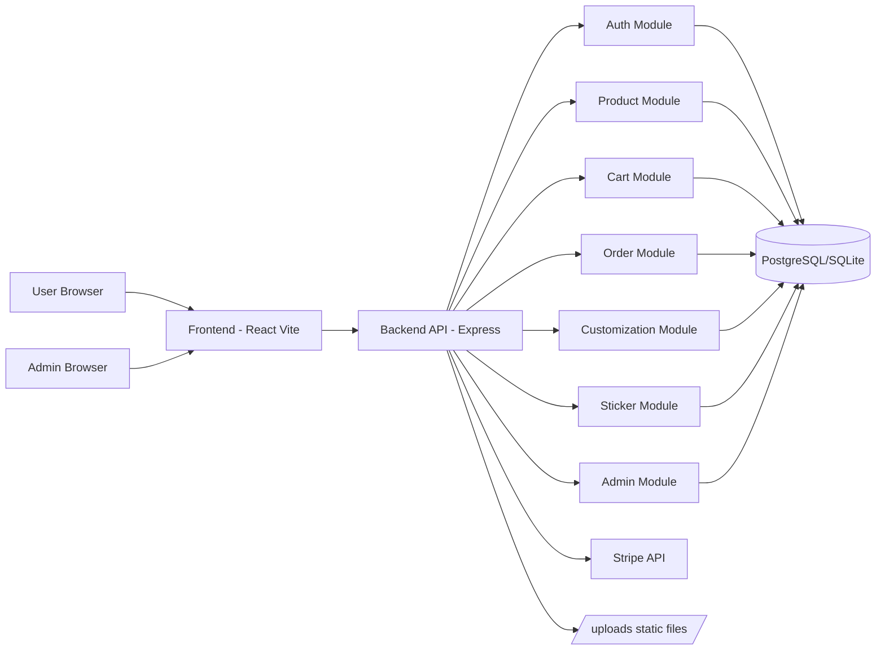
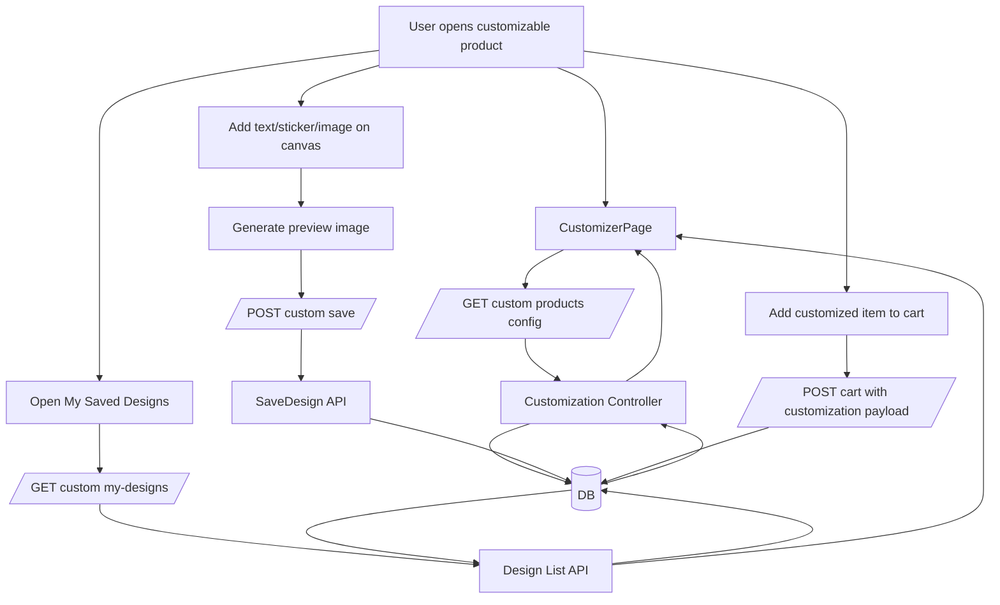
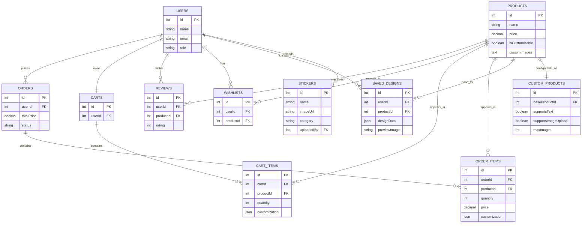

# ShopWave System Design Images

This file contains ready-to-render Mermaid diagrams for project documentation and report submission.

## 1. System Architecture Diagram

## 2. Customization Data Flow Diagram

## 3. ER Diagram

## 4. How to Export as Images

1. Open this file in VS Code Markdown Preview.
2. Use Mermaid preview/export extension if installed.
3. Export each diagram as PNG/SVG for your report.
